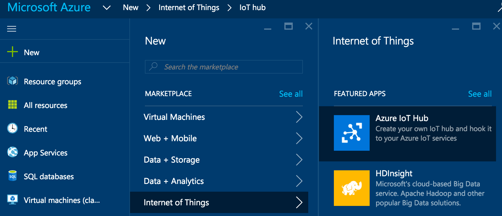
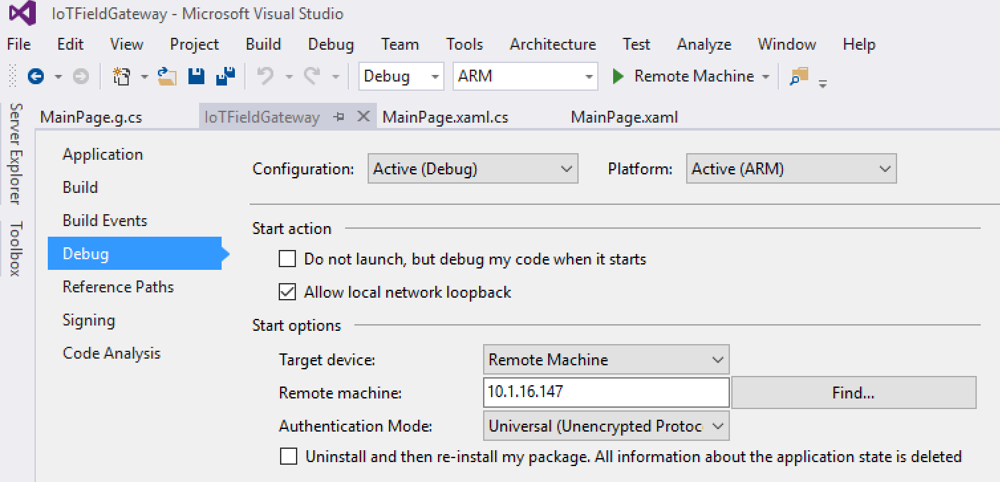

# SmartCoffee Mini-Hack
Brew a perfect cup of coffee from iOS and Android apps using [Xamarin](https://www.xamarin.com/) and [Azure IoT Hub](https://azure.microsoft.com/en-us/services/iot-hub/).

### The Challenge
This mini-hack will take you through the process of creating an iOS and Android app to remotely start and stop a smart coffee maker using Xamarin and Azure IoT Hub.

#### Getting Started
To begin the SmartCoffee mini-hack, you will need to ensure that you have the following items installed at a minimum:

* Visual Studio 2015 Community Edition **OR** Xamarin Studio Community Edition
* Xamarin

You will also need a pre-configured programmable coffee maker. The Darwin Lounge has four machines preconfigured, but for those not attending Xamarin Evolve 2016, the [hardware instructions are available online](https://www.hackster.io/windows-iot/raspberry-coffee-955b13).

**Special Note**: Do NOT plug in the Coffee Maker until instructed to do so.

#### Creating an Azure IoT Hub Instance
[Azure IoT Hub](https://azure.microsoft.com/en-us/services/iot-hub/) a easy way to connect to and communicate bidirectionally with Internet of Things devices, regardless of physical location. Azure IoT Hub also provides per-device identity and authentication to ensure that all communication with smart devices are secure. The SmartCoffee app built in this mini-hack sends messages to Azure IoT Hub, which delivers them to the device indentified as the recipient of the message. The Raspberry Pi receives this message from IoT Hub, and acts accordingly. For example, the SmartCoffee app may send a message to `coffeeMaker` with body "turn on", and the Raspberry Pi will then supply power to the correct GPIO pins to begin the brewing process.

###### 1. Begin an Azure Trial
If you don't already have an Azure account, [start an Azure free trial](https://azure.microsoft.com/en-us/pricing/free-trial/). If you have an existing Azure account, login at [portal.azure.com](http://portal.azure.com).

###### 2. Create a new Azure IoT Hub
Create a new Azure IoT Hub app from the Azure Portal by navigating to `New->Internet of Things->Azure IoT Hub`.



###### 3. Configure Azure IoT Hub
Give the IoT Hub a unique name for the hub, as well as a unique identifier for the Azure Resource Group. Leave the remaining defaults, and click `Create`. An IoT Hub will be created and deployed.

Congradulations! You have just created an Azure IoT Hub, which will broker all communication securely between our mobile app controller and our Raspberry Pi.

#### Building SmartCoffee for iOS and Android
In this section, you will build the SmartCoffee app using Xamarin.Forms to allow end users to remotely start and stop the brewing process.

###### 1. Open `SmartCoffee`
[Download the minihack repository](https://github.com/pierceboggan/smartcoffee-minihack/) and extract the archive. Navigate to the `mobile` folder, and open `SmartCoffee.sln` using either Xamarin Studio Communitity Edition or Visual Studio Community Edition.

###### 2. Generate Shared Access Signature
Each device must have it's own unique identifier and key. You can use [device identity APIs](https://azure.microsoft.com/en-us/documentation/articles/iot-hub-devguide/#identityregistry) to programmatically create identities for IoT devices. To speed things up, we will use the `DeviceProvisioningUtility` to generate values for us. Insert your IoT Hub url, policy name, policy key, and connection string from the Azure Portal into `Program.cs`.


Run the `DeviceProvisioningUtility` console application in `SmartCoffee.sln` to generate an identity (including a security key) for a device named `coffeeMaker` in IoT Hub. This will also generate a unique `Shared Access Signature (SAS)` token that will be used in the application as well. Be sure to copy both of these values for later use.

###### 3. Add Azure IoT Hub Credentials
Open `Constants.cs`. Enter the `Shared Access Signature` and your Azure IoT Hub url.

###### 4. Connect to Azure IoT Hub
Azure IoT Hub offers secure, bi-directional communication with several protocol options, including HTTP, MQTT, and AMQP. SmartCoffee uses AMQP for communication. Open `SmartCoffeeService.cs` and navigate to the `GetCoffeeServiceApi` method. Create a new connection to your IoT Hub by pasting the following information.

```csharp
if (connectionFactory == null)
   connectionFactory = new ConnectionFactory();
				
var address = new Address(Constants.HubHostName, 5671, Constants.Username, Constants.Password, Constants.RecipientLocation);
var client = await connectionFactory.CreateAsync(address);

return new SmartCoffeeService(client);
```

Also note the `SendMessageToDevice` and `ReceiveMessageFromDevice`, which use AMQP to send and receive messages to the device from Azure IoT Hub.

###### 5. Send a message to Azure IoT Hub
Now that our connection to IoT Hub is configured, it's time to start sending messages to it. For example, when a user taps the "Start Coffee" button, we need to send a message to the coffee maker letting it know the user wishes to begin the brewing process. Open `View Models/SmartCoffeeViewModel.cs` and navigate to the `ExecuteBrewCoffeeCommandAsync` method. At line 50, add the following code to send a message to IoT Hub.

```csharp
if (smartCoffeesService == null)
   smartCoffeesService = await SmartCoffeeService.GetCoffeeServiceApi();

if (!isCoffeeBrewing)
    await smartCoffeesService.SendMessageToDevice(TURN_ON_EVENT_MESSAGE);
else
    await smartCoffeesService.SendMessageToDevice(TURN_OFF_EVENT_MESSAGE);
```

Depending on the current brew state, SmartCoffee will either send the "Turn Coffee Maker On" or "Turn Coffee Maker Off" message to the device registered as `smartCoffee`.

The client app is now complete! We now can send messages directly to our internet-connected devices from iOS, Android, and Windows apps using Xamarin and Azure IoT Hub.

#### Configuring the Field Gateway App
In this section, we will deploy the "field gateway" application to a Raspberry Pi running Windows IoT Core, which is a compact version of Windows 10 for devices like the Raspberry Pi. This application will receive messages from Azure IoT Hub, such as "turn coffee maker on", the Raspberry Pi acts on that message by supplying power to the corresponding GPIO pins on the Pi to begin the brewing process.

###### 1. Configure the IoT Field Gateway application
Enter your Azure IoT Hub name, device id, and device primary key using the virtual keyboard.

###### 2. Deploy to Raspberry Pi.
Change the platform target to `ARM` and select the `Remote Device` option. Right-click the solution and select properties. Navigate to the `Debug` section and enter the IP address of the Raspberry Pi you are attempting to deploy to. If you aren't sure, be sure to ask a proctor!



Click `Remote Device` to deploy and begin debugging the field gateway app on the Raspberry Pi.

#### Start Brewing
In this section, you will begin the brewing process from the SmartCoffee application running on iOS and Android via Azure IoT Hub.

###### 1. Power on the coffee maker
Ensure that the coffee maker has a coffee filter, coffee, as well as adequate water for a brew. Plug the coffee maker into the power strip.

###### 2. Start listening for device messages
Click the `Start Listening` button on the Raspberry Pi field gateway application. This will begin listening to messages for the device from Azure IoT Hub.

###### 3. Brew your first cup of coffee, remotely!
Click the "Start Brewing" button on either the iOS or Android application. This will send a message to the Raspberry Pi via Azure IoT Hub, and appear in the messages queue list to verify delivery. Power is supplied to the corresponding GPIO pins on the Raspberry Pi, and the brewing process is begun!

**Important**: Please try not to brew more than one cup of coffee to allow as many attendees as possible to attempt the hack. Press the "Stop Brewing" button from the mobile application to halt the brewing process.

You just brewed some coffee using Xamarin and Azure IoT Hub! Alert a Darwin Lounge proctor so that they can verify completion of the hack. If you enjoyed the hack, be sure to share it on social media:

* I just brewed a cup of coffee from a mobile app using @xamarinhq & @MicrosoftIoT at #XamarinEvolve: [PHOTO]
* The future is here! Just started a coffee maker remotely from a mobile app using @xamarinhq & @MicrosoftIoT at #XamarinEvolve: [photo]
